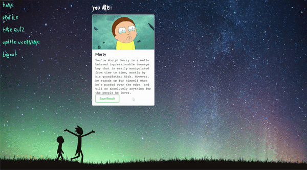
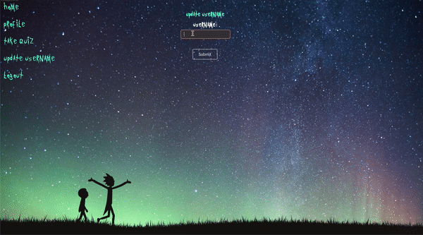

<h1 align="center">Let's Get Schwifty🧪</h1>

A `React` application that allows users to take a 'Which character are you?' quiz based on the T.V. show Rick and Morty!

## Technologies
This web app makes use of the following technologies:

**Frontend**
- React.js
- React Router - implemented for delcaritive routing
- Semantic UI React
- Customized CSS3 styling

[**Backend**](https://github.com/rlc900/rick-and-morty-quiz-backend)
- Ruby [2.6.1]
- Rails [~> 6.0.2, >= 6.0.2.1] - MVC web framework used as an API
- Bcrypt [~> 3.1.7] - Encrypt and secure user passwords
- Rack-cors - Handles Cross-Origin Resource Sharing (CORS), which makes cross-origin AJAX possible
- JWT [~> 2.2] - Cryptographic signing
- PostgreSQL [>= 0.18, < 2.0] - Database

## Prerequistes
Before you continue, please make sure you have installed the latest version of:
- Ruby
- Ruby on Rails
- PostgreSQL
- React

## Launch
To launch this application, you'll have to follow these steps:

**Backend Installation**
- Clone [this repo](https://github.com/rlc900/rick-and-morty-quiz-backend.git) in your computers terminal.
- After cloning, `cd` into that directiory `cd rick-and-morty-quiz-backend/`.
- Run `bundle install` to install the required dependencies.
- Make sure PostgreSQL is running on your machine.
- Run `rails db:create` to create a database locally.
- Run `rails db:migrate` to create tables into the database.
- Run `rails db:seed` to create seed data.
- Run `rails s` to run the server.

**Frontend Installation**
- Clone [this repo](https://github.com/rlc900/rick-and-morty-quiz-frontend.git) in your computers terminal.
- After cloning, `cd` into that directiory `cd rick-and-morty-frontend/`.
- Make sure your Backend API is running at http://localhost:4000/.
- Run `npm install` to install all dependencies.
- Run `npm start` to start server.
- Once you're taken to the web app, ensure Frontend is running at http://localhost:3001.

## Features
Users are able to signup/login into their account.

The user is redirected to their profile page, and can take the quiz by clicking on 'Take Quiz' on the the navbar located on the left!

After the quiz is finished, a character card with the characters name, picture & description appears with the character that is most like the user! They're also able to add they're result to their profile page. 

Users are also able to update their username and delete their account!

